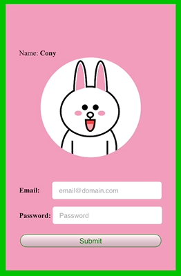
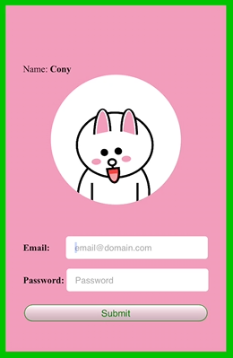
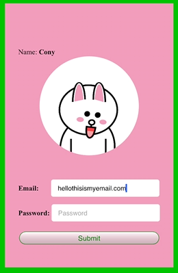
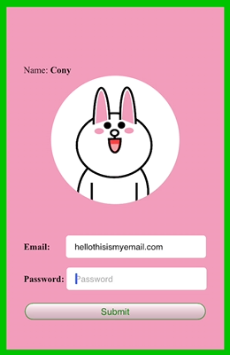
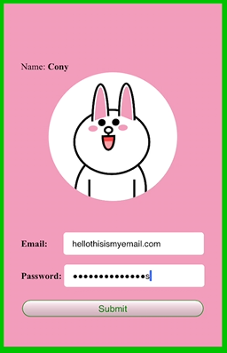

> ## cony-login
- A responsive login form with character gestures
- HTML/CSS, SVG, JavaScript

#### Initial idea
  1) Login Critter (Bear): https://github.com/cgoldsby/LoginCritter
  2) Extension from (1) - (Ryan character from Kakao Corp.): https://github.com/taggon/ryan-login
  3) Extension on my end from (2) - (Cony from NAVER Line Friends)

#### Character generation
- The original character is based from NAVER Line Friends - Cony character. All rights are reserved for the company.
- The character is manually generated with SVG, Scalable Vector Graphics. 

#### 
> #### Scalable Vector Graphics shapes
> - Circle
> - Ellipse
> - Bezier/Quadratic, Discrete/Continuous Curve
> - (Free) Path
> - Arc
> (for more details, refer to Mozilla Developer Network
> https://developer.mozilla.org/en-US/docs/Web/SVG/Tutorial/Basic_Shapes)

> LINE Friends: [Official Website]

[Official Website]: https://www.linefriends.com/

    
> 1) Initial 
> 2) Once cursor is in email field, the character notices by looking down
> 3) Character follows through the cursor
> 4) Character purposely looking away (up) from the password field
> 5) Looped motion

> Original Character Icon  

